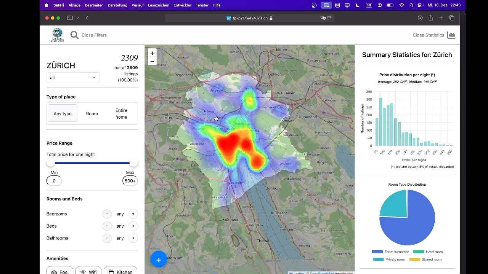
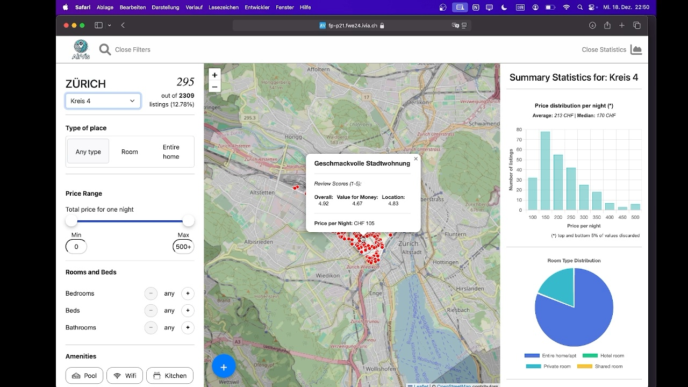
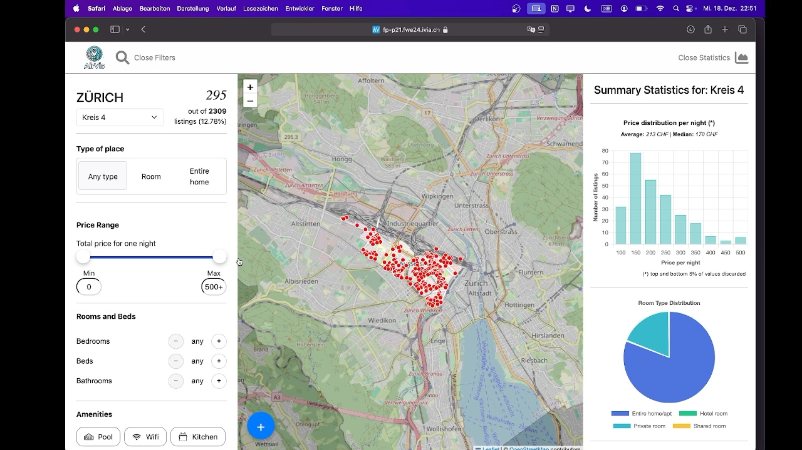
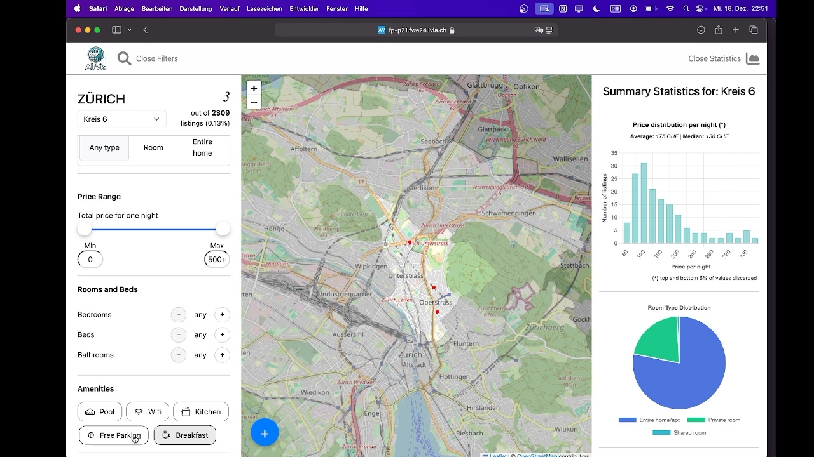
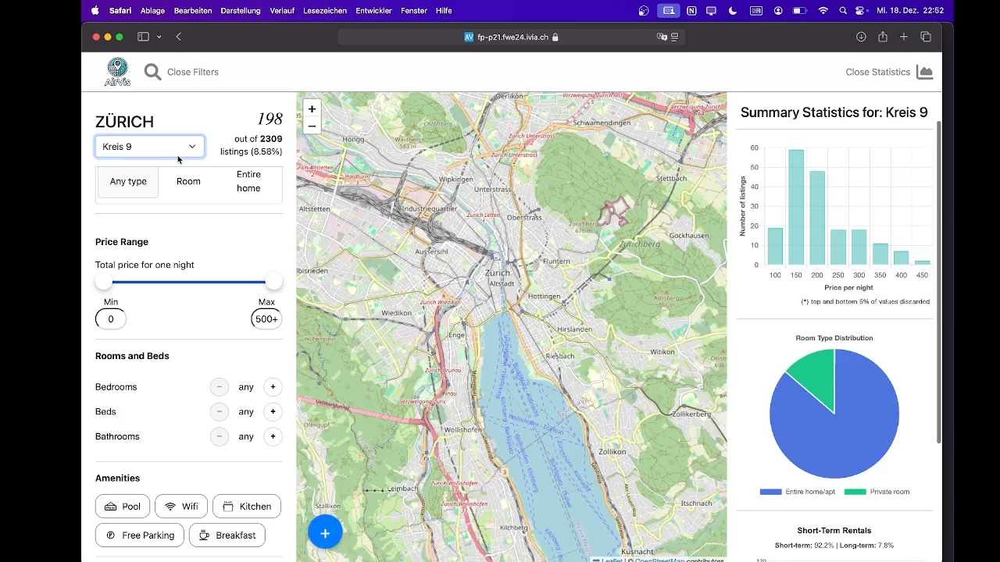

# Airvis

Airvis is a frontend dashboard for exploring Airbnb listings in Zürich. It combines a map, price and room-type charts, and straightforward filters so that users can quickly understand where listings are located and how the available options compare.

## Demo video

[Watch the Airvis dashboard demo](docs/airvis-demo.mp4)

The recording walks through the Zürich listing map, summary statistics, and the available filtering controls.

## Dashboard walkthrough

### 1. City-wide dashboard

The main view brings filters, listing counts, price charts, and the interactive Zürich map into one workspace. The heatmap makes city-wide location patterns easy to scan before narrowing the results.



### 2. Concrete listing details

Selecting a marker in Kreis 4 opens a listing popup. This example shows *Geschmackvolle Stadtwohnung*, including its CHF 105 nightly price and the location, price, and value scores.



### 3. District listing markers

After selecting a district, the city heatmap is replaced by individual listing markers and the district boundary. This makes it easier to compare nearby listings directly.



### 4. District filters

Users can focus on a type of place and set a nightly price range. District, amenity, room, bed, and bathroom controls refine the result set further.



### 5. District statistics

The statistics panel updates with each district and shows the price distribution, room-type mix, and short-term rental share alongside the filtered map.



## What it shows

- A heatmap for the city-wide distribution of listings and individual listing markers for a selected district.
- Listing counts, price range, room type, and amenity filters.
- Price distribution, room-type breakdown, and short-term rental statistics.
- A ZIP download of the source listing data and a browser Print-to-PDF option.

## Run locally

Start the React client from `frontend`:

```bash
npm ci
npm run dev
```

Open `http://127.0.0.1:5173` in a browser. The dashboard expects a compatible API at `http://127.0.0.1:8000`.

## Technical outline

The frontend uses React, TypeScript, Vite, Leaflet, and Chart.js.

## Repository scope

This public repository contains the frontend only. The original backend is excluded because it bundles a large local SQLite database with raw listing records. Keeping that data outside the public repository keeps the project lightweight and avoids publishing the bundled dataset.
