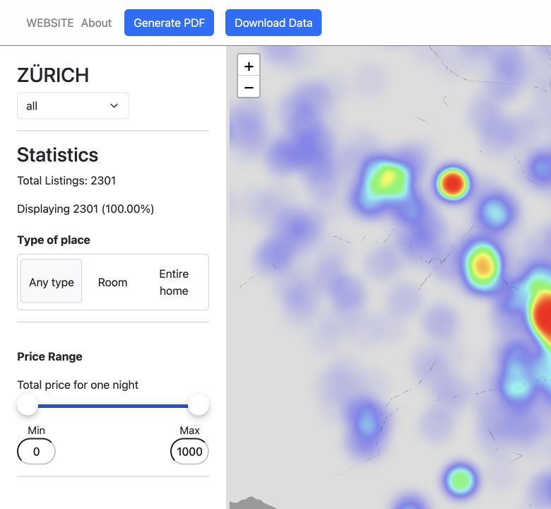
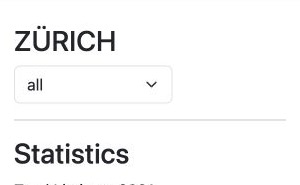
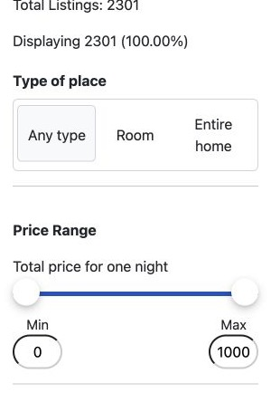
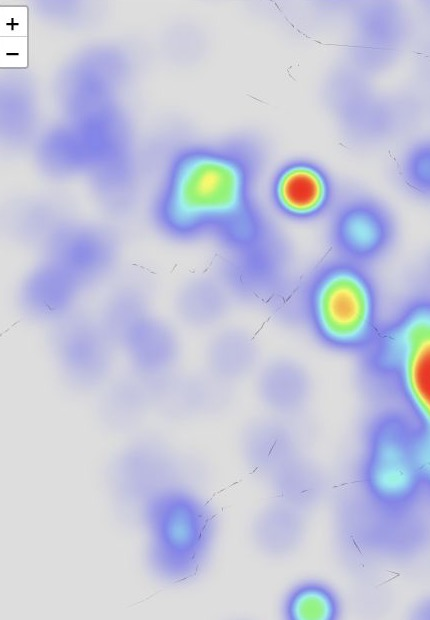

# Airvis

Airvis is a frontend dashboard for exploring Airbnb listings in Zürich. It combines a map, price and room-type charts, and straightforward filters so that users can quickly understand where listings are located and how the available options compare.

## Dashboard walkthrough

### 1. Complete dashboard

The main view brings filters, listing counts, and the interactive Zürich map into one workspace. It is designed to make location and availability patterns easy to scan before narrowing the results.



### 2. Quick actions

The header provides two practical actions: export the current page through the browser's Print-to-PDF flow or download the underlying listing data as a ZIP file.


### 3. Listing overview

The statistics panel shows the total number of listings and updates the displayed result count as the filters change, so users can immediately see the impact of a selection.



### 4. Filter controls

Users can focus on a type of place and set a nightly price range. Additional district, amenity, room, bed, and bathroom controls let them refine the result set further.



### 5. Zürich heatmap

The city-wide map uses a heat layer to show where listings are concentrated. Selecting a district replaces this overview with individual listing markers and the selected area boundary.



## What it shows

- A heatmap for the city-wide distribution of listings and individual listing markers for a selected district.
- Listing counts, price range, room type, and amenity filters.
- Price distribution, room-type breakdown, and short-term rental statistics.
- A ZIP download of the source listing data and a browser Print-to-PDF option.

## Run locally

Start the React client from `frontend`:

```bash
npm ci
npm run dev
```

Open `http://127.0.0.1:5173` in a browser. The dashboard expects a compatible API at `http://127.0.0.1:8000`.

## Technical outline

The frontend uses React, TypeScript, Vite, Leaflet, and Chart.js.

## Repository scope

This public repository contains the frontend only. The original backend is excluded because it bundles a large local SQLite database with raw listing records. Keeping that data outside the public repository keeps the project lightweight and avoids publishing the bundled dataset.
